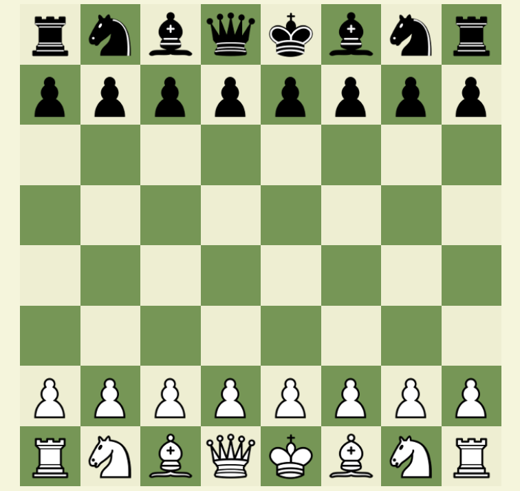

# Chess#

## About The Project
It may take few seconds to start up application

### Built With
* [Application hosted with https://portal.azure.com/](https://docs.microsoft.com/en-us/azure/azure-portal/azure-portal-overview) 
* [ASP.NET](https://dotnet.microsoft.com/apps/aspnet)
* [HTML](https://www.w3.org/html/)
* [CSS](https://www.w3.org/Style/CSS/Overview.en.html)
* [JavaScript](https://developer.mozilla.org/en-US/docs/Web/JavaScript)

## Usage

After the page loads, a checkerboard is displayed. To move a pawn, click on it, then choose one of the possible squares on the board and click on it.
to start a new game refresh the page.
